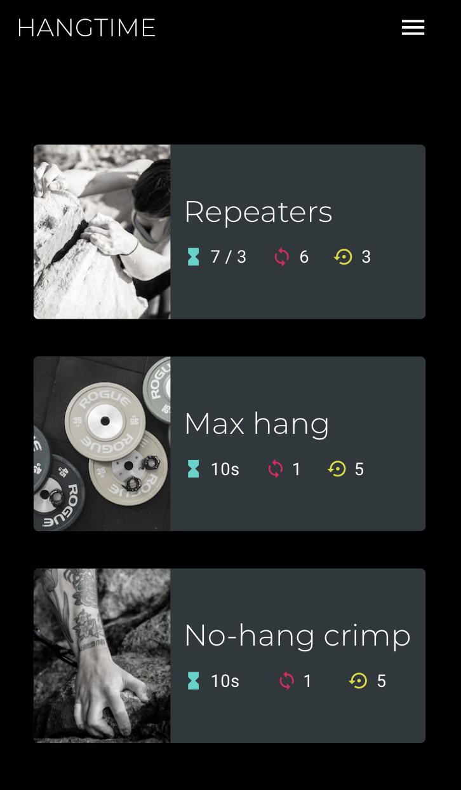
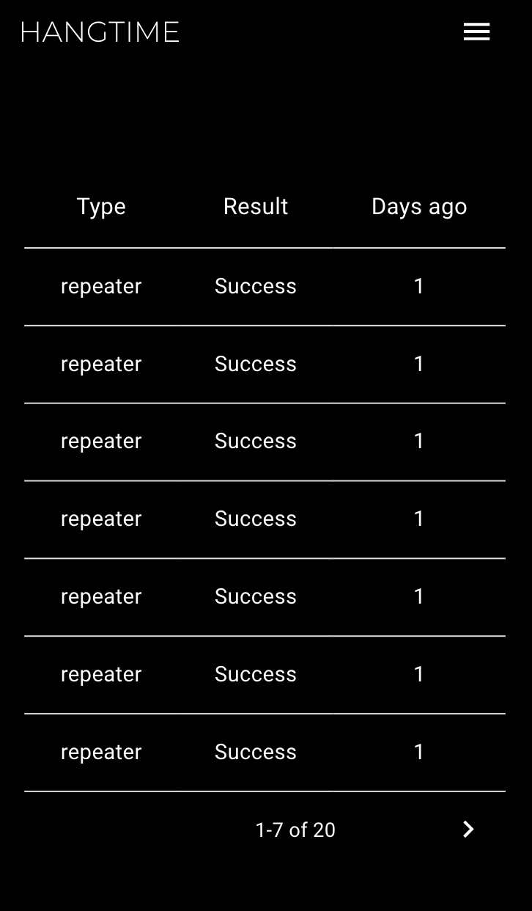

&nbsp;&nbsp;&nbsp;Login&nbsp;&nbsp;&nbsp;|Workouts|&nbsp;&nbsp;Timer&nbsp;&nbsp;&nbsp;&nbsp;&nbsp;|&nbsp;&nbsp;&nbsp;&nbsp;History&nbsp;
:-:|:-:|:-:|:-:
|||

## Hangtime-client
This simple and easy to use workout app is for training finger strength for rock climbing by doing hangboard repeaters, max-hang or no-hang crimp.

## Prerequisites
Clone this repo to your desktop and run npm install to install all the dependencies.

## Development
After you clone this repo to your desktop, go to its root directory and run npm install to install its dependencies.

Once the dependencies are installed, you can run npm start to start the application. You will then be able to access it at localhost:3000

## Build
npm run build builds the app for production to the build folder. It correctly bundles React in production mode and optimizes the build for the best performance.

## Versioning
We use SemVer for versioning.
